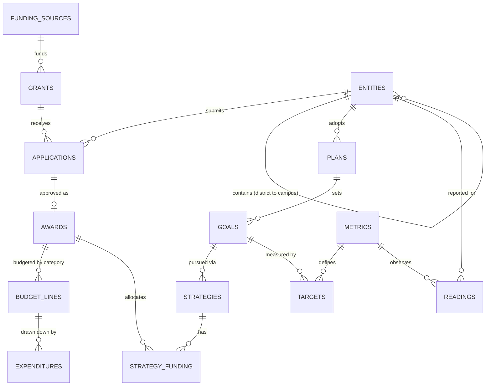

# grantweave

An open-source reference implementation of a **unified grant management system**: grants, plans, entities, funding sources, and performance metrics in one linked data model — the data shape at the core of public-sector grant administration, where the question that matters is not "what did we award?" but *"what did each funding source actually move?"*

Built by [ForwardIT](https://theforwardit.com) as a public, inspectable demonstration of the domain. It is intentionally small enough to read in one sitting and complete enough to answer cross-domain questions end to end.

## Quickstart

Requires Node.js 24+ (the database is Node's built-in SQLite — no native dependencies, nothing to install but npm packages).

```bash
npm install
npm test          # full suite: lifecycle invariants, hierarchy rules, roll-up reports, API
npm run seed      # builds data/grantweave.db with a two-district demo dataset
npm run dev       # serves the REST API on http://127.0.0.1:3000
```

Then, for example:

```bash
curl http://127.0.0.1:3000/reports/funding-impact
```

returns every funding source traced through awards → funded plan strategies → goals → metric readings, with percent-progress toward each target — five domains in one query.

## The data model



The five RFP-shaped domains and how they link:

| Domain | Tables | Linked to |
|---|---|---|
| Funding sources | `funding_sources` | every grant carries its source; every report can group by origin (federal/state/local/private) |
| Grants | `grants`, `applications`, `awards`, `budget_lines`, `expenditures` | applications tie grants to entities; awards carry the fiscal chain |
| Entities | `entities` (self-referencing: service center → district/charter → campus) | applications, plans, and readings all anchor to an entity; roll-ups walk the subtree |
| Plans | `plans`, `goals`, `strategies`, `strategy_funding` | strategies are funded by awards — the join that connects money to intent |
| Performance | `metrics`, `targets`, `readings` | targets bind metrics to goals; readings bind metrics to entities over time |

## Enforced invariants

These are guarded in the service layer (with SQLite `CHECK`/`UNIQUE`/FK constraints backing them) and each has a failing test:

- Application lifecycle is a state machine: `draft → submitted → under_review → approved/rejected`, with `withdrawn` reachable until decision; awards can only be created from approved applications, one award per application.
- Σ awards per grant ≤ the grant's appropriation; Σ budget lines ≤ awarded amount; Σ expenditures per line ≤ that line; budgeting and spending freeze when an award is suspended or closed.
- Σ planned strategy funding per award ≤ awarded amount.
- **Funding alignment**: a plan's strategies can only be funded by awards belonging to the plan's entity or its subtree — a district plan can spend its campuses' awards, never a neighboring district's.
- Entity hierarchy rules (a campus must belong to a district or charter), one plan per entity per fiscal year, one application per entity per grant, one reading per metric/entity/period.
- Targets must move in the metric's declared direction (an "increase" metric cannot target below baseline).
- All money is integer cents, enforced at three layers: API schema (`type: integer, minimum: 1`), a domain guard, and a `typeof(...) = 'integer'` CHECK in the SQLite schema.
- All periods are ISO dates and must be real calendar dates ("2026-02-30" is rejected, not stored).

## Reports

| Endpoint | Question it answers |
|---|---|
| `GET /entities/:id/funding-summary` | For a district (campuses included via recursive CTE): awarded / budgeted / spent / remaining, by funding origin |
| `GET /grants/:id/utilization` | For a grant: appropriation vs. application pipeline vs. awarded vs. spent |
| `GET /plans/:id/performance` | For a plan: each goal's strategies, the dollars behind them, and latest metric progress toward target |
| `GET /reports/funding-impact` | Across the system: which funding sources are moving which metrics, where, at what cost |

`funding-impact` rows are one per (funding source, target): `funded_cents` is the money behind the goal that the target measures, so a goal with several targets repeats its funding on each row — sum across a single goal's rows and you double-count by design.

Browsing endpoints: `GET /health`, `GET /funding-sources`, `GET /grants`, `GET /entities` list the raw records; everything richer is served report-shaped.

Write endpoints cover the full lifecycle: `POST /funding-sources`, `/grants`, `/entities`, `/applications`, `/applications/:id/transition`, `/awards`, `/awards/:id/budget-lines`, `/budget-lines/:id/expenditures`, `/plans`, `/plans/:id/adopt`, `/plans/:id/goals`, `/goals/:id/strategies`, `/goals/:id/targets`, `/strategies/:id/funding`, `/metrics`, `/readings`. Domain violations map to structured errors (`409` invalid transition/duplicate, `422` budget exceeded/funding misaligned, `404` not found). Every request body and path parameter is validated against a JSON schema before it reaches the domain layer, so malformed input — missing fields, bad enums, fractional or non-numeric cents — returns a structured `400`.

## Design notes

- **SQLite via `node:sqlite`** — zero native dependencies, so `npm install && npm test` works anywhere Node 24 does (the module still prints an `ExperimentalWarning`; its API has been stable since Node 22.5). The schema is plain SQL (`db/schema.sql`) and portable to Postgres unchanged in structure.
- **Integer cents** for every monetary column; no floating-point money.
- **Services over ORM** — each domain operation is a small function taking the database handle, so invariants live in exactly one place and the whole call path is readable.
- The seed dataset (`npm run seed`) is fictional: two districts, three funding streams, a district improvement plan whose strategies are funded by two different awards, and three semesters of metric readings — enough to make every report return something worth looking at.

## Roadmap

- Reimbursement request / drawdown approval workflow on top of expenditures
- Amendment history on awards (period extensions, amount changes) with an audit table
- Role-based access and per-entity scoping at the API layer
- A Postgres profile and a read-model for dashboard aggregation
